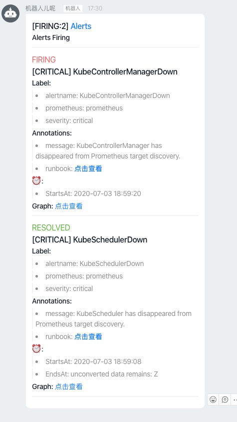

# alertmanager-webhook
接收alertmanager webhook消息，格式化后发送到钉钉机器人或者其他渠道

# 启动方式
```shell script
sh bin/start.sh
```

# 消息模板
可通过修改templates/ding.html自定义ding消息的markdown格式，模板使用jinja2语法，支持灵活的表达式、函数以及filter，可参考[文档](https://jinja.palletsprojects.com/en/2.11.x/)

# 调用方式
```shell script
curl --location --request POST 'http://127.0.0.1:5000/webhook?robot=somerobot' \
--header 'Content-Type: application/json' \
--data-raw '{
   "receiver":"webhook",
   "status":"firing",
   "alerts":[
      {
         "status":"firing",
         "labels":{
            "alertname":"KubeControllerManagerDown",
            "prometheus":"prometheus",
            "severity":"critical"
         },
         "annotations":{
            "message":"KubeControllerManager has disappeared from Prometheus target discovery.",
            "runbook_url":"https://github.com/kubernetes-monitoring/kubernetes-mixin/tree/master/runbook.md#alert-name-kubecontrollermanagerdown"
         },
         "startsAt":"2020-07-03T10:59:20.304Z",
         "endsAt":"0001-01-01T00:00:00Z",
         "generatorURL":"http://prometheus:9090/graph?g0.expr=absent%28up%7Bjob%3D%22kube-controller-manager%22%7D+%3D%3D+1%29&g0.tab=1",
         "fingerprint":"a57c6beb4cba02ea"
      },
      {
         "status":"resolved",
         "labels":{
            "alertname":"KubeSchedulerDown",
            "prometheus":"prometheus",
            "severity":"critical"
         },
         "annotations":{
            "message":"KubeScheduler has disappeared from Prometheus target discovery.",
            "runbook_url":"https://github.com/kubernetes-monitoring/kubernetes-mixin/tree/master/runbook.md#alert-name-kubeschedulerdown"
         },
         "startsAt":"2020-07-03T10:59:08.995Z",
         "endsAt":"0001-01-01T00:00:00Z",
         "generatorURL":"http://prometheust:9090/graph?g0.expr=absent%28up%7Bjob%3D%22kube-scheduler%22%7D+%3D%3D+1%29&g0.tab=1",
         "fingerprint":"c4361f8386527768"
      }
   ],
   "groupLabels":{

   },
   "commonLabels":{
      "prometheus":"prometheus"
   },
   "commonAnnotations":{

   },
   "externalURL":"http://prometheus:9093",
   "version":"4",
   "groupKey":"{}:{}"
}'
```

# 效果预览
